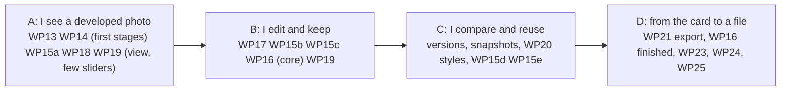

# Milestone M2 plan: basic RAW development, from the card to a file

> **Status: adopted (D-143, 2026-09-30).** The plan of
> the second milestone, in the form of the [M1 plan](m1-plan.md): a goal, exit criteria, work packages,
> questions to settle first, acceptance scenarios, an order and the risks. It follows the milestone
> table of the [specification](functional-specification.md) (§8), the [architecture](architecture.md)
> (§6, §7, §8), the [testing strategy](testing-strategy.md) (§4) and the [release plan](continuous-integration.md),
> and it builds on [design note 005](design/005-image-engine-interfaces.md) and D-140 to D-142.
> Items are tagged **[decided]**, **[proposed]** or **[open]**: adopting the plan adopts its packages,
> increments and order; the proposed answers of §6 each still come back as a design note and, where they
> change a format or the behaviour, a decision. There are no calendar dates: the plan
> gives an order, sizes and exit criteria; sizes are relative (S, M, L, XL), as in M1.
>
> **It was started before it was written.** Charlie has begun the image engine's foundation
> ([#37](https://github.com/Straycat-Software/auroraw/pull/37)) while M1 finishes, so this plan records
> what exists (§1) and puts the rest in order around it.

## 1. Goal, and where we start

### 1.1 Goal [decided, spec §8]

**M2 gives the photographer basic RAW development, from the card to a file**: a non-destructive
pipeline with its basic operations, versions and snapshots, styles and settings reuse, colour
management, GPU acceleration, the built-in operations written as plugins, and a minimal export (JPEG,
TIFF, PNG; size, profile, metadata setting; D-062). M1 already gives the card, the culling and the
organising; M2 adds the part of the job in between.

Not in M2: masks and local retouching, lens corrections, negative scans and the advanced operations
(M3); export recipes, the queue, the watermark and publication (M4); the public plugin API and the AI
features (M5). Consequences to state plainly:

- **The operations are the list of spec §5.6 for M2** [proposed]: RAW input (demosaicing, white balance,
  exposure and black point, highlight reconstruction, hot pixels), tone (contrast, highlights, shadows,
  whites, blacks, curve), colour (saturation, vibrance, hue-saturation-luminance, colour grading),
  detail (sharpening, noise reduction), geometry (crop, straighten). §5 orders them so that an
  increment ships without the last ones if it has to.
- **The operation plugins of M2 are internal.** The built-in operations go through the same declaration
  as a plugin's (D-142) and are registered the same way, but no external operation plugin is loaded in
  M2: the host's shader safety check is M3 (D-077), and the descriptor's data form waits for it.
- **Two follow-ups left by M1 come due**: the quality aids (peaking, clipping, histogram, sharpness)
  computed on the preview are redone on developed data in the Develop view (WP23), and an import
  profile's "apply a style" setting starts to act (WP20). The copy-on-demand of a non-local original
  when it is developed (an open item of M1's WP8) belongs to WP18.

### 1.2 What exists today

| Piece | State |
| --- | --- |
| Design of the interfaces | Note 005 is written and accepted; D-140 (recipe, render API, dependency edges, the render service), D-141 (`RawImage`'s ABI) and D-142 (the declaration in two layers, typed parameters) are in `dev` ([#38](https://github.com/Straycat-Software/auroraw/pull/38)), with the architecture changed to match. |
| `pipeline` | The crate is in `dev` ([#37](https://github.com/Straycat-Software/auroraw/pull/37)): adapter choice with a typed error, the GPU thread, device loss recovered, the smoke test, CI with lavapipe, WARP and the macOS runner's adapter (all three pass). No stage yet. |
| Decoding | `rawler` as a WebAssembly plugin returns a sensor mosaic with averaged levels (spike 4's shape); D-141 replaces it. `imaging` decodes previews and thumbnails on the CPU. |
| Versions | The version sidecar exists with its metadata overrides and an `extra` bag for "the development, in M2"; nothing writes operations, history or snapshots. The engine has no version commands. |
| Interface | The image view shows the camera's embedded preview (RGBA8 through a Qt image provider); there is no Develop view. The controls of D-136 and the icons of D-137 exist. |
| Export | Only the XMP export of M1 (#22). No image export. |

M1 is not finished (WP10's remaining items, WP11, WP12): §8 says how the two overlap.

## 2. Exit criteria [proposed]

M2 is done when **all of these hold on Linux, Windows and macOS**, by the automated suite where possible
and by the release checklist (testing strategy §11) otherwise:

1. **The scenarios of §7 pass**, on the eight-plus-nine sample RAW files (note 005 §3.3, §3.3b) and on
   a small real catalogue.
2. **The budgets** of the specification (§9) that concern M2 are met on Patrick's reference machines:
   visual feedback for an adjustment **under 50 ms on a 24 MP image** (draft quality while a control is
   dragged, final on release), a **24 MP export under 2 s** through the M2 chain, a photo opened in
   Develop showing its embedded preview at once and the developed image right after.
3. **One recipe renders the same on the three graphics APIs** (Vulkan, DirectX 12, Metal) within the
   bound of testing strategy §4.2: at most one level in 8 bits on at least 99.9 % of pixels, on the
   final output. **"The same" means within that bound, not bit for bit**: two GPUs and two drivers do
   not agree to the last bit, and the plan does not promise it.
4. **Every stage has a CPU reference and a golden render**; the smoke test compiles every shader on the
   runners' software adapters and is blocking (already true of the probe, #37); tiling equals the whole
   and the stage caches are correct (testing strategy §4, items 5 and 6).
5. **Edits are never lost and renders are reproducible**: a crash at any moment loses no edit (the
   history is in the version sidecar), a restart renders the same pixels, and a version renders the same
   after an operation or a plugin is updated (its recorded versions decide, spec §5.6).
6. **The catalogue can be deleted and rebuilt** with the versions, the main version and the snapshots
   (the permanent test of the testing strategy), and **originals are never modified**.
7. **The machine's graphics are handled as ordinary events**: no adapter is an error that says so, a
   software adapter works and is said to be in use, a lost device is re-created and the render replayed,
   and running out of graphics memory shrinks the work instead of failing (architecture §6.3, §6.6).
8. **Colour is right where it can be checked**: the working space, the camera-to-working-space step, the
   input profile of a non-RAW file, the output profile of an export and the display profile, judged on
   Linux and Windows (D-071); macOS is checked for what a remote desktop can show (exports read back
   with their profile), not for the screen.
9. **Accessibility and translation**: every control of the Develop view has an accessible name and a
   keyboard path, sliders and curves included; English and French are complete; the pseudo-locale check
   passes.
10. **Interoperability**: an exported JPEG, TIFF and PNG open in other software with the right colours
    (the embedded profile) and the metadata the export setting promises (D-046).
11. **Installable pre-release `0.2.0`** for each platform with the user-visible documentation of
    Develop and export, and the packages able to reach the graphics adapter (Flatpak included, CI
    document open item 3).

## 3. What is in and out [proposed]

| In M2 | Out (later milestone, or open) |
| --- | --- |
| The pipeline of spec §5.6: decode, demosaic (Bayer, X-Trans), sRAW and linear inputs, white balance, exposure and black point, highlight reconstruction, hot pixels, tone, colour, sharpening, noise reduction, crop and straighten | Local adjustments, lens corrections, negatives, dehaze, clarity, perspective, vignetting, grain (M3) |
| Versions (create, duplicate, delete, name, main version), a persistent linear history, snapshots, compare | Comparing two versions with a wipe (stretch), merges (HDR, panorama, stacking: later) |
| Styles (one concept: a preset is a one-tool style), the base look, selective copy and paste, auto-sync, a style applied at import | Importing Lightroom or darktable settings (open, spec Q12) |
| Colour management: a fixed wide-gamut linear working space, input profiles, output profiles, the display profile per platform | Soft proofing (the architecture allows it, later) |
| GPU development with the CPU-reference tests, software adapters as the fallback, device loss and memory pressure handled | A second, fast Rust CPU path (only if a real machine needs it, D-140); AI noise reduction and masks (M5) |
| The Develop view: guided panels by task, before/after, histogram, clipping warnings, 100 % zoom, previous and next photo, the version strip | Panel layouts the photographer arranges; fully custom plugin panels (not planned for v1) |
| The built-in operations as internal plugins (D-142, declaration and registry) | External operation plugins, the shader safety check, the descriptor's data form (M3) |
| Minimal export: JPEG, TIFF (8 and 16 bit), PNG; size, profile, metadata setting; the main version or chosen versions; from the interface and the CLI | Recipes, the queue, the watermark, output sharpening settings, DNG conversion, publication (M4) |
| The Develop version of the quality aids, on developed data | The AI aids (M5) |

## 4. How the work is organised [proposed]

**Three conversations, three grounds** (Patrick's division of 2026-09-30, to limit the context each
needs): **Charlie** the image processing and the GPU (`pipeline`, the shaders, the references, the
colour maths, `xtask gpu-check`); **Bob** the interface, UX and Qt (the Develop view, the controls, how
pixels reach the screen); **Alice** the architecture, the decisions and the organising and management
tools (`develop`, the version model and its files, styles, the engine's render service, `export`,
the plugin API as a public surface). Each package below names a **lead**; the seams between grounds
are the three of note 005 and the contracts written in the notes of §6, agreed in an issue before
either side codes against them. Nothing here changes who reviews what: Patrick owns the formats, the
write path and the sandbox.

**Increments, not one big bang**, as in M1: four pre-releases, each usable for something, the first
being a thin vertical through all layers on three platforms, so that platform, driver and packaging
problems appear early (§8).

**A short design note before each package that fixes a format or an interface**, in `docs/design/`,
then a decision entry (governance §1). The notes M2 needs are listed in §6. Code waits for its note;
the pipeline's foundation (#37) did not need one.

**Vertical slices**, tests first where a reference exists: a package is finished when it works from the
interface to the disk, with its CPU reference and golden render (for a stage), its strings in English
and French, its accessible names and its keyboard path. **Every stage lands with its CPU reference and
its golden render in the same change**, because a GPU stage without a reference cannot be reviewed.

**Real GPUs are Patrick's.** Hosted runners have software adapters only (llvmpipe, WARP, the macOS
virtual device), which prove that shaders compile and agree with their reference and say nothing about
speed. Timings and the cross-API comparison on real adapters come from `cargo xtask gpu-check` (CI
document §4), which Patrick runs on his machines (an NVIDIA card and an Intel iGPU, Vulkan and DirectX
12 on Windows) and posts as a file; WP24 builds it.

**Format discipline from the first day**, as in M1: each new format (the development in the version
sidecar, the styles file, the recipe's encoding, the decoder's metadata block) arrives with its schema
version, its fixture, its "unknown content is preserved" test and, for the parsers of untrusted bytes, a
fuzz target.

## 5. Work packages [proposed]

Numbering continues from M1 (WP0 to WP12). "Needs" lists what must exist first; "Lead" is the proposed
conversation.

### WP13 Interfaces: the decoder's output and the declaration (M). Needs D-140 to D-142. Lead: Alice, with Charlie

The change D-141 and D-142 decide, in `plugin-api`: the new `RawImage` (layout, levels as a pattern, white
balance, matrices, crop, orientation, camera, input profile), the **block of tagged sections** that
carries the metadata across the sandbox and its documentation, `Family::Operation`, `ParamSpec`,
`ParamValue` (bool, int, float, enum, colour, point, list, curve), `OperationId` and the declaration's
new fields. The decoder plugin and the host follow, with **a fixture per sample file** (seventeen, three
of which `rawler` refuses: the refusal is a routine result), a fuzz target for the block's parser, the
test that lifts the float-samples refusal on the float DNG, and the orientation taken from the EXIF that
`imaging` reads until `rawler`'s behaviour is understood.

Done when: every sample decodes (or is refused cleanly) into the new `RawImage` through the sandbox,
native and WebAssembly agree byte for byte, and the parser survives the fuzzer.

### WP14 The pipeline crate: the render API and the engine around it (L). Needs #37, WP13. Lead: Charlie

From the foundation to a service: `Pipeline::open(config, registry)`, `render(request)` and its handle
(`wait`, `try_recv`, `cancel`), `Recipe` and `OperationInstance`, the canonical hash, the stage graph built
from a recipe and **validated** (an operation outside its stage is refused), the **stage caches** keyed by
image, recipe prefix, geometry and quality, draft and final quality, the three views (`Fit`, `Region`,
`Full` streamed in bands into a sink with back-pressure), the report (stages rerun and served from cache,
adapter and kind, quality rendered, memory), banding with a halo from the operations' declarations,
graphics memory as an ordinary event (error scopes, views and bands sized from what is available, half
precision if note-005-§7's measurement says so), device loss handled by re-creating the device and
replaying the request, and the queue made inspectable (priorities, "latest wins"). The operation trait of
D-142's layer 2 lives here.

Done when: a hand-written recipe renders through all of it on the three platforms' software adapters
against references; tiling equals the whole and cached equals from scratch (property tests); a late change
reruns nothing earlier (counted); a render survives an injected device loss and a forced memory shortage.

### WP15 The operations (XL). Needs WP14, WP16 for the last step. Lead: Charlie

Sliced so that an increment can ship without the last slices; each operation is one declaration, one
implementation (the trait), one CPU reference and one golden, plus a panel description for WP19:

- **15a Input**: Bayer demosaic (the gradient-corrected method of spike 1), the generic pass for X-Trans
  and the question of a proper one (§6, item 11), linear and monochrome inputs, black and white levels
  per pattern, white balance folded into the camera matrix, hot pixels, the camera-to-working-space step.
- **15b Tone**: exposure and black point, the base look's tone curve, contrast, highlights, shadows,
  whites, blacks, the curve (control points); **highlight reconstruction** in its simple form.
- **15c Colour**: saturation, vibrance, hue-saturation-luminance, colour grading.
- **15d Detail**: sharpening; **noise reduction** (the choice of algorithm is §6, item 8; the draft variant
  keeps it inside the budget).
- **15e Geometry**: orientation, crop, straighten (crop in output coordinates, the pattern phase at the
  crop, sensor geometry never seen by callers).

Done when: each operation matches its reference inside its stated tolerance on the synthetic inputs of
testing strategy §4 (ramp, zone plate, hard edges, clipped highlights, black and white frames, extreme
parameters, odd sizes) and on the real samples of each input path.

### WP16 Colour management (L). Needs WP14. Lead: Charlie, with Bob for the display side

The fixed working space of the Rec.2020 class (spec Q21), **confirmed against ProPhoto RGB by the
measurement of §6 item 2 before the operations depend on it**, the colour engine chosen by the criterion of
note 005 §7 (ΔE, speed, `cargo deny`), **input profiles** (ICC or named, for the non-RAW inputs), the
**output transform** (display profile for views, an ICC profile and bit depth for export), and the
**display profile per platform** (colord, the Windows colour system, ColorSync), which is a small
platform module handing ICC bytes to the engine, with the interface reading them. The interface keeps
displaying bytes unaltered (spike 2 and 5 checked it).

Done when: a chart's patches come out within the ΔE bound through each profile pair, an sRGB and a
wide-gamut display show the same photo with the same colours on Linux and Windows, and the preview's
"converted to sRGB" of M1 (D-084) is replaced by the engine's transform.

### WP17 `develop`: the version model and its files (L). Needs WP13 (declaration), the design notes of §6 items 1 and 4. Lead: Alice

Versions in the engine (create from scratch, another version, a snapshot or a style; duplicate and try;
name; delete recoverably; **main version**, D-038), the **operation instances** with their typed
parameters, the **pipeline definition v1** as a documented, versioned file, **placement** from the
declaration (`develop` places, the pipeline validates), the order and every operation's and plugin's
version recorded, **a missing plugin opens disabled and marked** with its settings kept, the **persistent
linear history** with compaction, **snapshots**, the **base look** (D-042: "no version is written until the
first edit"), the development written in the version sidecar (operations, history, snapshots: a schema
bump with a fixture and a migration, unknown content preserved), the rebuild reading it back, and the
engine's commands and events (`Command::SetOperation`, `CreateVersion`, `Snapshot`…, undo as §6 item 5
decides). Versions appear in the catalogue (a count per photo, the main version's thumbnail source).

Done when: a scripted session through the CLI creates versions, edits, snapshots, restores, kills the
process, and reopens to the same recipe; the catalogue rebuilt from the workspace has the same versions;
a version whose plugin is missing opens disabled with its values intact.

### WP18 The render service in the engine (M). Needs WP14, WP17. Lead: Alice, with Charlie and Bob

The service beside the coordinator (D-140): the `Pipeline` handle held by the engine, **decoding through
the plugin host into a source cache** (least recently used, sized from the memory available, the photo in
Develop plus one neighbour), **`Invalidate(ImageKey)`** when an original changes, the **priorities**
(interactive, visible, background) and cancellation from the interface, `RenderReady` with its report,
and the pixels pulled by id through an **image provider** (with Bob: the copy cost of a 2560 × 1440 RGBA8
frame at interactive rates is measured first). The embedded preview is shown at once while the RAW
decodes. Copy-on-demand of a non-local original when it is developed lives here. Nothing in it goes
through the single writer: a render writes nothing.

Done when: dragging a control in a test harness yields a draft frame in budget and a final frame on
release, a newer request drops an older queued one, changing photo cancels the old work, and the
interface thread never waits on a render.

### WP19 The Develop view (XL). Needs WP15 (some operations), WP17, WP18. Lead: Bob

**Guided panels by task** (Light, Colour, Detail, Geometry) built from the operations' declarations
(sliders, curves and pickers drawn by Auroraw, consistent, translatable and accessible: the declarative
interface of spec §5.10), the image view with fit and 100 % and zoom and pan, **before/after**, the
histogram and clipping warnings on the developed image, **previous and next photo from the keyboard without
leaving Develop**, the **version strip** (one key to switch), the history and the snapshots (name, compare,
restore, turn into a version), "duplicate and try", reset per control and per panel, and the Develop
tab's place in the tasks. Keyboard paths for everything a pointer does; the curve editor is operable by
keyboard.

Done when: a session of the reference workflow (spec §4) can be done with the keyboard only, in French,
with a screen reader announcing each control and its value.

### WP20 Styles and settings reuse (M). Needs WP17. Lead: Alice, with Bob

**Styles** at user level in the configuration folder, shared by every catalogue (D-052), as files that can
be imported and exported: a named subset of operation instances, a one-tool style being a preset (spec
§5.4); the **base looks** shipped (neutral, flat linear); **selective copy and paste** of settings to one or
many photos as one undoable action; **auto-sync** (Q18 decided first); the import profile's **"apply a style"**
starts to act. Applying is a one-off copy with no lasting link (D-039).

Done when: a style applied to 500 photos is one undo; changing the style later touches no photo that used
it; a style file round-trips and keeps what it does not know.

### WP21 Minimal export (M). Needs WP14, WP16, WP17. Lead: Alice, with Charlie and Bob

The `export` crate and its job: JPEG, TIFF (8 and 16 bit) and PNG encoders fed by the pipeline's **band
sink** (an encoder starts on the first band, memory stays bounded), long-edge size, the output profile
embedded, the **metadata setting** of D-046 applied through the existing sidecar machinery, naming, a
destination (the workspace or any folder; a warning when it is a source folder, D-024), the main version by
default or a chosen set, a job with progress and cancellation, `auroraw-cli export`, and the dialog.

Done when: the export of a 24 MP photo meets the budget on the reference machine; the files open in other
software with the right colours and metadata; a cancelled export leaves no half file; an export of the
103 MP file completes inside the graphics memory of a 4 GB card.

### WP22 The internal operations as plugins (S to M). Needs WP13, WP14, WP17. Lead: Alice

The **registry** the engine fills from the built-ins and, later, from the host; the declaration validated
as D-078 asks (an impossible order or an unknown stage is refused with the reason); the built-ins
registered through exactly that path; a conformance test every operation passes (its declaration is valid,
its defaults are inside its limits, it matches its reference, its halo covers what it reads). No external
operation plugin is loaded: the test suite includes spike 4's GPU operation as a *declaration* case only.

### WP23 The quality aids on developed data (S to M). Needs WP18, WP19. Lead: Bob, with Charlie

The clipping warnings, histogram, peaking and sharpness score of the Develop view computed from the
developed image (a GPU histogram where it pays), and the decision of whether the Cull mode keeps using
the preview for speed (proposed: yes, with "on the RAW" offered once a decoded source exists).

### WP24 Verification, performance and platforms (L, alongside). Lead: Charlie

`cargo xtask gpu-check` and `compare` (CI document §4); the **golden renders** and their tolerances; the
cross-API comparison; the **budget benchmarks** (slider to pixel, export) with the machine and adapter
recorded; the memory, device-loss and no-adapter scenarios as tests with injected faults; the
stress files (the 103 MP mosaic, the 61 MP files of spike 1); the fuzz targets of WP13 and of the recipe
and development parsers; the diagnostic that tells a person which adapter and which compiler a machine is
using.

### WP25 Packaging, documentation, release `0.2.0` (M). Needs the rest. Lead: Alice

The manual's Develop and export pages with pictures, translations complete, the release checklist run on
three platforms, the packages reaching the adapter (Flatpak's Vulkan access, the Windows and macOS
installers), the notes of what M2 does not do yet.

## 6. Questions to settle at the start [proposed answers]

Each becomes a short design note (the number is the next free) and, if it changes a format or the
behaviour, a decision after Patrick's approval.

| # | Question | Proposed answer | How it is checked |
| --- | --- | --- | --- |
| 1 | **Pipeline definition v1** (spec Q17): the stages, their data spaces, the ordering-constraint language | Stages: decode, raw-linear (levels, hot pixels, white balance), demosaic, denoise, scene-linear (exposure, highlights, tone, colour), detail, geometry, display/output transform, encode; constraints `after`/`before` within a stage only; the definition is a versioned file; its own design note (Charlie, Alice) | Golden renders in definition order; the order rule measured again (white balance after the denoiser: 0.6 ms against 120 ms) |
| 2 | **Colour engine and working space** (Q21) | The working space is **linear Rec.2020-class by default, fixed, and written into the pipeline definition** (item 1), so that changing it later is a new definition version, recorded in the sidecars, and old edits render as before. It is **confirmed against linear ProPhoto RGB by measurement in increment A, before the tone and colour operations (15b, 15c) are written against it**: Rec.2020 has real primaries and the D65 white of sRGB and Display P3, ProPhoto holds more saturated colours but has imaginary primaries and a D50 white. ProPhoto stays available as an **output** profile whatever the working space. The engine is chosen by note 005 §7's criterion, compared before it is chosen | The comparison table and `cargo deny` for the engine; ΔE on a chart. **For the working space**, the 17 sample files (note 005 §3.3, §3.3b) rendered in both spaces with the same camera matrices and the same output: (a) the share of values negative or clipped after the camera-to-working step, per file, and on saturated blues and greens in particular (LED lights, flowers); (b) the hue shifts of saturation, vibrance, hue-saturation-luminance and colour grading on those colours, against a reference; (c) the cost and the error of the D50 to D65 adaptation on the way to sRGB and Display P3; (d) Patrick's judgement of the borderline photos on his Linux and Windows screens. Charlie measures, Patrick judges |
| 3 | **Base look and the flat linear look** (Q23) | A documented tone-mapping method (scene-linear to display, one curve with a stated toe and shoulder), neutral by default; the flat linear look shown as the raw linear data under the display transform | Reference images on the samples; a review by Patrick on his screens |
| 4 | **The development in the version sidecar** (Q4, Q20) | Operations and snapshots as typed XMP properties, the history as JSON inside one property, each operation with its identifier, its version and its plugin's; a schema bump with a fixture and a migration; its own design note (Alice) | Round trip and unknown-content tests; the sidecar read by ExifTool; size of a history of 10,000 steps |
| 5 | **History and undo in Develop** | The version's own persistent linear history *is* Develop's undo (Ctrl+Z walks it, editing after an undo discards the undone steps); the engine's in-memory journal (D-096) keeps serving Cull and organising; the two are not merged, and a keyboard shortcut means the one of the active view | A scripted undo/redo session across views; nothing in the history grows without bound (compaction) |
| 6 | **Auto-sync** (Q18) | Off by default, per session; applies the *change* (a delta), not the state, to the selection, so photos with different settings keep them; one undo step | A test on a selection of photos with different values |
| 7 | **CPU fallback** | As D-140: the same shaders on whatever adapter there is, the software one said to be in use; no second Rust path unless Patrick finds a machine where WARP is unusable | WARP timings on the Windows runner; a real test machine without a GPU if one can be had |
| 8 | **Noise reduction** (Q38, risk 10) | Non-local means is the yardstick, not the choice; pick a GPU-friendly algorithm with a draft variant by a stated quality criterion (noise removed against detail kept, on the real samples); AI noise reduction is M5 | The criterion's numbers; 32 ms in draft and 120 ms at 2560 × 1440 as the bound to beat |
| 9 | **Intermediates in half precision** | Measured before it is adopted: store packed, compute in f32 (note 005 §7) | Banding on a ramp; the error accumulated through the chain |
| 10 | **Highlight reconstruction and hot pixels** | The simple, documented forms for M2 (clip-aware, per-channel); better algorithms are operations later, behind the same declaration | Clipped-highlight inputs; samples with stuck pixels |
| 11 | **X-Trans demosaic** | Start with the generic 6 × 6 pass of spike 1 and mark it as such; a proper algorithm is a package of its own if the result is visibly worse on the Fujifilm samples (Patrick judges) | Side-by-side against a reference converter on the X-T50 and GFX files |
| 12 | **Declarative panels** | A panel is described by the declarations (a slider with limits and a step, a curve, a picker, a colour); Auroraw draws it; the grouping into tasks comes from the declaration's `panel` | A panel built for each M2 operation without a custom view; accessibility checked |
| 13 | **Interactive frames: draft, fit and zoom** | Draft quality while a control is dragged, final on release; fit-to-screen runs the same stages on a reduced image; zoom renders the visible region with its halo; frames are pulled as RGBA8 | Timings on Patrick's machines; the copy cost to Qt measured first (WP18) |
| 14 | **Source cache budget** | A small LRU of decoded sources (about 120 MB for 60 MP): the photo in Develop and one neighbour, dropped under memory pressure; a batch export decodes one at a time | A test with a 103 MP file and a forced shortage |
| 15 | **Minimal export details** | JPEG quality setting and a long-edge size; TIFF 8 and 16 bit; PNG; the output profile embedded; sharpening for output is not in M2 | Files read back in ExifTool and two image programs |

## 7. Acceptance scenarios [proposed]

Written as tests where they can be, and run by Patrick where they cannot; each on the sample RAW files and
on a small real catalogue.

1. **From the card to a file.** Import 100 RAW files, cull, open one in Develop (the embedded preview at
   once, the developed image right after), adjust white balance, exposure, contrast, colour and
   sharpening, crop, go to the next photo with the keyboard, then export five as sRGB JPEG at 2048 px and
   see them in another program with the same colours.
2. **Nothing is lost, nothing drifts.** Edit, kill the application, restart: the history is there and
   the render has the same pixels. Change the version of an operation in a build: the old edit renders
   as before.
3. **Versions and snapshots.** "Duplicate and try", a snapshot, compare with the current state, restore,
   turn a snapshot into a version, change the main version and see the grid's thumbnail follow.
4. **Reuse.** Copy chosen settings and paste them on 50 photos (one undo); apply a style at import; change
   the style afterwards and see the photos that used it unchanged; auto-sync on a series.
5. **Graphics that misbehave.** Run on the software adapter: the same image within the bound, and the
   interface says so. Lose the device in the middle of a render (the test hook): the render is replayed.
   Shrink the graphics memory: the work shrinks and finishes.
6. **The big file.** Develop and export the 103 MP mosaic on a 4 GB card without exhausting memory.
7. **A missing plugin.** Open a version that uses an operation whose plugin is absent: it is disabled and
   marked, its settings kept, everything else renders.
8. **Rebuild.** Delete the catalogue and rebuild: the versions, the main version, the snapshots and the
   styles' use are back.
9. **Three APIs.** The same photo and recipe on Linux (Vulkan), Windows (DirectX 12) and macOS (Metal):
   within one level on 99.9 % of pixels.
10. **The first development session** on a clean machine, in French, with a screen reader and the keyboard.

## 8. Order and increments [proposed]

| Increment | Delivers | Exit |
| --- | --- | --- |
| **A. I see a developed photo** (`0.2.0-alpha.1`) | `RawImage` and the decoder, the pipeline's first stages (decode, demosaic, white balance, exposure, tone, display) on the three platforms, the render service and the source cache, the Develop view with a few sliders. Edits are not saved. | Scenario 5 in its first form; the slider-to-pixel budget on a reference machine; the sample set develops or is refused cleanly. |
| **B. I edit and keep** (`alpha.2`) | Versions and the persistent history in the sidecar, the rest of tone and colour, colour management of the core path, the panels from declarations, history and undo in Develop. | Scenarios 2 and 8; the determinism tests. |
| **C. I compare and reuse** (`alpha.3`) | Versions and snapshots in the interface, styles, copy and paste, auto-sync, the style at import, sharpening, noise reduction, crop and straighten. | Scenarios 3 and 4. |
| **D. From the card to a file** (`0.2.0`) | Minimal export, colour management finished, the aids on developed data, `gpu-check` and the performance record, documentation, packaging, the release checklist. | Every exit criterion of §2. |

**It overlaps the end of M1.** M1's remaining packages (WP10's place names and smart collections, WP11,
WP12) are Alice's and Bob's; increment A needs Charlie's work, which does not wait for them, and the
decisions and the `RawImage` change, which do. The proposed order: Charlie continues the pipeline
foundation and the stages now; Alice wrote the decisions (#38) and does WP13 and the design notes of §6 while she
finishes M1's last items; Bob starts WP19 when M1 is released or when his part of M1 allows, on the
render service's interface. The first M2 pre-release comes after `0.1.0`. A package that cannot wait for
its lead is reassigned by Patrick, not by default.

An increment's pre-release goes to Patrick to test on his machines; the sizes above are re-estimated at
the end of A.

## 9. Risks and open points

| # | Item | Risk | Mitigation or decision |
| --- | --- | --- | --- |
| 1 | **Real-GPU verification depends on one person's machines** | Hosted runners have software adapters; speed, driver quirks and the cross-API comparison come only from Patrick's NVIDIA and Intel cards and a dual boot. | `gpu-check` produces one file to post; the record is kept per machine; no budget is claimed that has not been measured there. |
| 2 | **DirectX's compiler** | FXC rejected a construct the other two accept (spike 1) and will do it again. | The portable WGSL subset is a rule; the smoke test is blocking on every platform; the compiler in use is printed; DXC stays an option. |
| 3 | **Determinism is per GPU, not bit for bit** | Two drivers and two GPUs differ in the last bits; a promise of identical pixels would be false. | The promise is the bound of testing strategy §4.2, tested across APIs; stored hashes of recipes prove *the same recipe*, not the same pixels; said in the documentation. |
| 4 | **Colour cannot be judged everywhere** | No toolkit applies the display profile (spike 2); a Mac is reachable only by remote desktop (D-071), where neither colour nor timing is reliable. | Colour is judged on Linux and Windows; macOS is checked for exports and profiles; a Mac for M2 would be welcome (§10). |
| 5 | **Graphics memory is shared and varies** | 64 MB to 1.3 GB in one afternoon; a 103 MP mosaic is 207 MB before any stage. | Errors, not panics; bands and views sized from what is available; half precision if measured safe; tests with injected shortage. |
| 6 | **The Windows software adapter is slow** | WARP took 3 s for a 24 MP render and is 27 times slower than a GPU on the denoiser. | Rare case (DirectX 12 adapters are everywhere); reported to the person; a second path only on evidence (D-140). |
| 7 | **The interface cannot take a frame fast enough** | Copying a 2560 × 1440 RGBA8 frame to Qt 60 times a second may cost more than the render. | Measured first in WP18 (the spike read back 2 MP in 0.9 ms); if it does not hold, the image provider is reconsidered with Bob before the view is built. |
| 8 | **Decoder coverage** | `rawler` refused three of nine chosen files and reports a wrong orientation for two Sony files. | Refusals are routine results; the EXIF orientation is used; LibRaw as a later plugin; camera-support issues with samples (governance §3). |
| 9 | **History and sidecar growth** | A long session produces a large JSON history in the version sidecar, on a slow disk. | Compaction; a size budget per history; the sidecar rewritten atomically, the history appended in batches rather than per slider tick. |
| 10 | **Undo in two places** | The engine's journal (D-096) and a version's history can confuse a person. | §6 item 5: one undo per view, the active view's; tested; the wording of the menu says which. |
| 11 | **Scope creep inside the list** | HSL, colour grading and highlight reconstruction can each take a package. | They are slice 15c and in the simple form; an increment ships without them if it must. |
| 12 | **Three conversations drift apart** | Interfaces change in one ground and break another. | Notes and decisions before code; conformance tests for the declaration and the recipe; seams changed only through an issue. |
| 13 | **Review load** | Every shader and every format wants the owner's review. | Small changes, references as the review aid, the checklist of the pull request template. |
| 14 | **AI-written code volume** | A large amount of GPU code arrives quickly; shader mistakes are subtle. | Every stage has an independent CPU reference; property tests; the DCO; the owner's review on formats, the write path and the sandbox. |

## 10. What is needed from Patrick [proposed]

- **Approval** of this plan (D-143), and of the answers of §6 as each design note comes up.
- **Real-GPU time**: running `cargo xtask gpu-check` on his machines at the end of each increment and
  posting the file, and colour judged on his screens (Linux and Windows), ideally with a calibrated
  display profile installed.
- **A Mac** for the colour checks of macOS, if one can be had; otherwise macOS stays checked for what a
  remote desktop can show.
- **Sample files**: a 16-bit linear RGB DNG (issue #35) and a file with a non-`Normal` orientation; his own
  photos for dogfooding (never in the repository).
- **The decisions marked open** in §9 and §6, when their package approaches (notably the noise-reduction
  algorithm and the X-Trans result).
- **A reassignment rule** if a lead is late (§8).

## 11. Next

1. Review this plan.
2. **WP13**: the `RawImage` and declaration change of D-141 and D-142, one pull request per layer
   (`plugin-api`, the plugin, the host).
3. The design notes of §6 items 1 and 4 (the pipeline definition v1 with the base look; the development in
   the version sidecar, history and undo), one at a time, for approval, under the next free numbers.
4. Charlie: the render API and the first stages on the foundation of #37, with their references.
