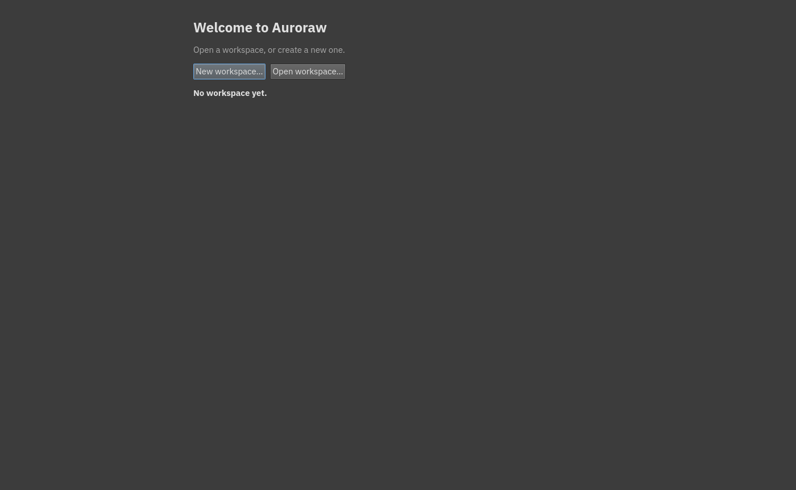
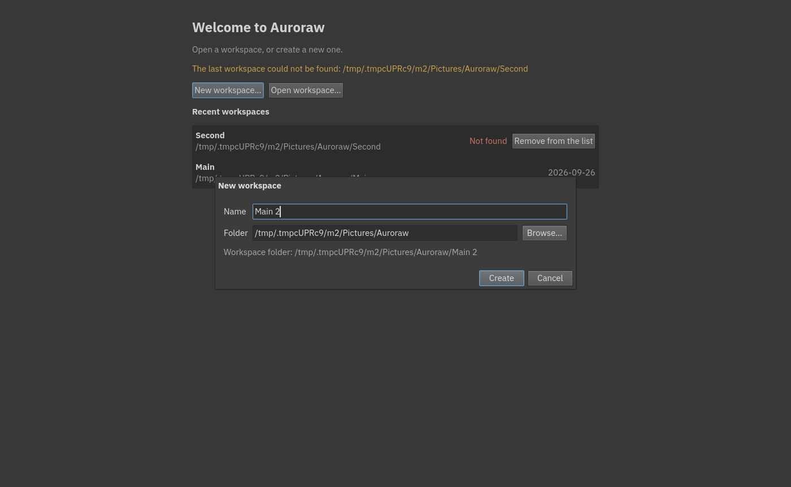
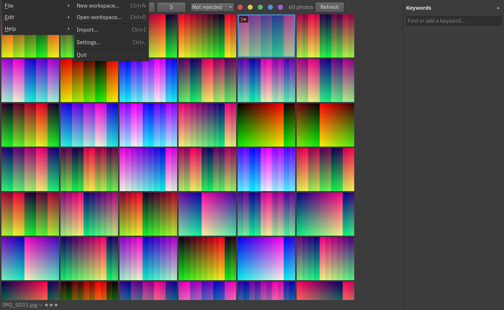
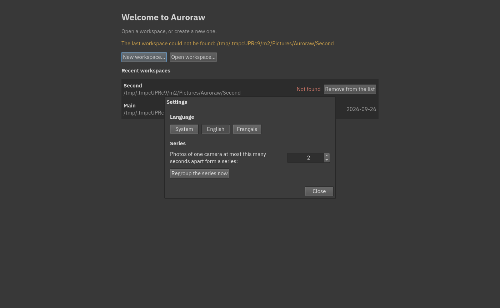

# First steps

## What you need to know first

Auroraw keeps two things apart:

- your **photos**, which stay where they are (on a card, in your Pictures folder, on a disk) and are never
  changed, moved or deleted by Auroraw;
- your **workspace**, a folder Auroraw owns, where it writes everything you decide about your photos: ratings,
  flags, colour labels, keywords, series. The workspace is what you back up.

## The welcome screen

The first time you start Auroraw, it offers to create a workspace or open one that already exists. Later starts
reopen the last workspace you used; if it cannot be found (a disk that is not plugged in, a folder that moved), the
welcome screen comes back with a message, and the list of **recent workspaces** shows which one is *Not found*
(you can remove it from the list).

## Creating a workspace

Choose **New workspace…** (`Ctrl+N`). Give it a name and pick a folder (the suggestion is a folder with that name
in `Pictures/Auroraw`). The folder must not exist yet, or be empty. Auroraw creates it, and opens the
**Catalogue** tab, because a new workspace has no photos yet: the next step is to [add a
source](02-bringing-photos-in.md).

To open a workspace you already have, choose **Open workspace…** (`Ctrl+O`) and pick its folder, or click it in the
recent list. Opening a workspace that already holds photos shows them in the **Cull** tab.

## The window

- The **☰ menu** at the top left has **File** (new and open workspace, Settings, Import, Quit), **Edit** (undo and
  redo, select all, keywords, cut, copy and paste in text fields) and **Help** (About). `Alt` and a section's
  underlined letter open it from the keyboard.
- The tabs beside it are the tasks: **Catalogue** (your sources), **Cull** (looking at photos and sorting them out).
  **Develop** and **Publish** are not available yet.
- A line at the top shows notices, for example that a card was detected.

## Settings

**File ▸ Settings…** (`Ctrl+,`) holds:

- **Language**: *System* (follow the computer), *English* or *Français*. The change is immediate.
- **Series**: the largest gap between two photos of a series, and a button to regroup the series
  (see [Series](05-series.md)).

## Next

[Bringing photos in](02-bringing-photos-in.md).
