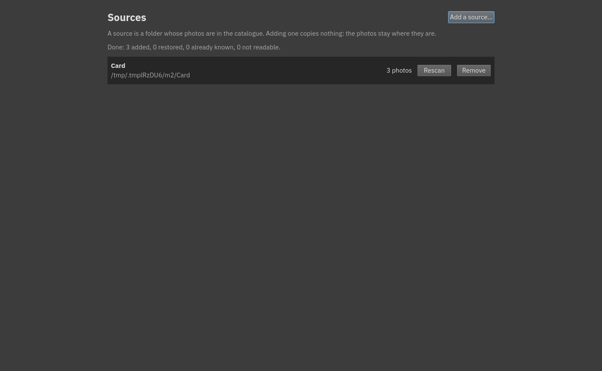
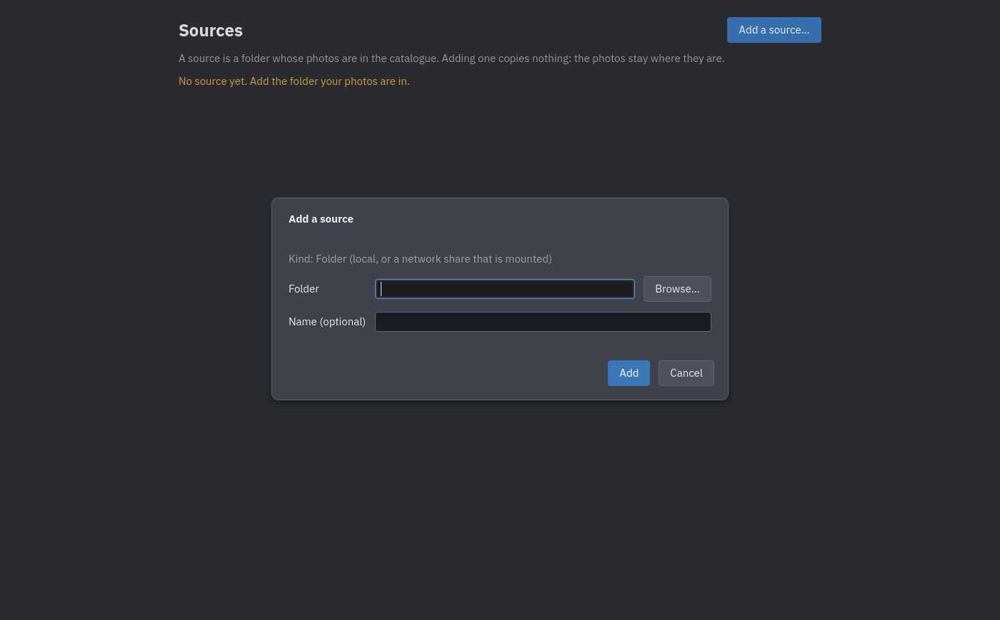
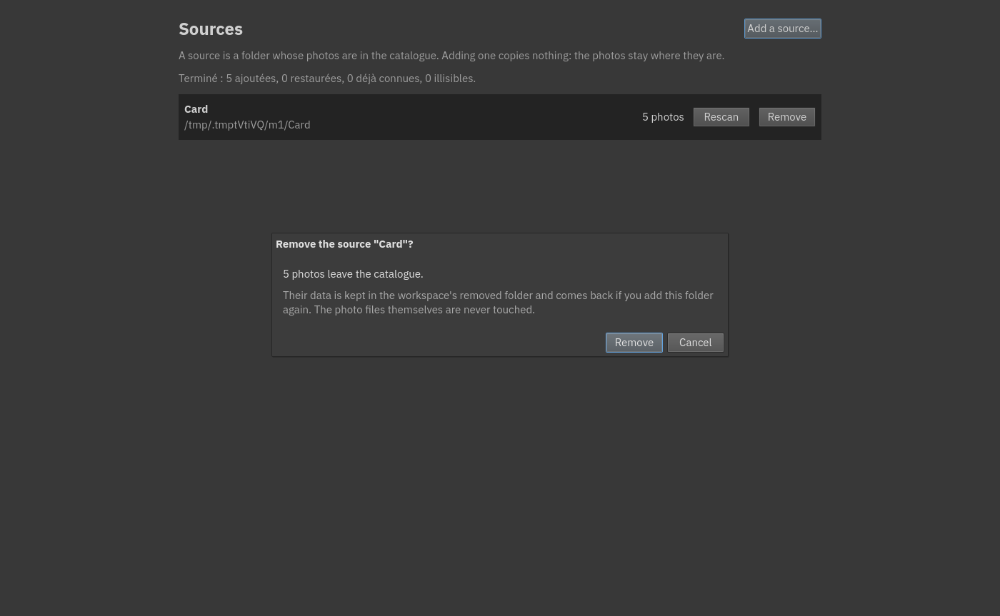
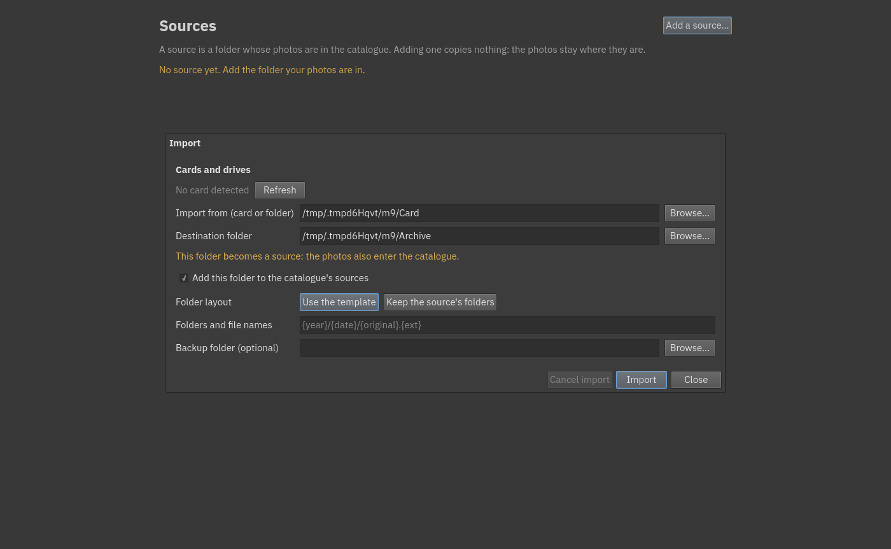

# Bringing photos in

There are two ways to get photos into the catalogue, and they are different things:

- **Add a source**: tell Auroraw about a folder that already holds photos. Nothing is copied; the photos stay
  where they are and appear in the catalogue.
- **Import**: copy the photos from a card or a folder to a place you choose (and optionally to a backup), then
  catalogue them.

## Sources (the Catalogue tab)

A **source** is a folder whose photos are in the catalogue. The **Catalogue** tab lists your sources, each with
its photo count.

### Adding a source

Choose **Add a source…**, pick the folder (a local folder, or a network share that is mounted), and optionally
give it a name. Auroraw scans the folder, reads each photo's information (date, camera, exposure) and its
embedded preview, and builds the catalogue. A progress line says *Reading photos: 120 of 480…*, and ends with a
summary such as *Done: 480 added, 0 restored, 0 already known, 0 not readable.* You can keep working while it
runs. Only still images are read; RAW files and JPEGs are both supported, and a RAW file with its JPEG
next to it is one photo with two files.

If the folder you add **contains** sources you already have, Auroraw asks whether to **merge** them into the new
one: their photos, ratings and other work are kept. A folder that is **inside** a source you already have is
refused with the reason, since its photos are in the catalogue already.

### Offline sources

If a source's folder cannot be reached (an unplugged disk, an unmounted share), it is marked **Offline**. Its photos
stay in the catalogue with their thumbnails and everything you did to them; only the originals are out of reach
(the image view then says *The original is not available*). Plug it back in and choose **Rescan**.

### Rescanning

**Rescan** reads the source again: new files are added, and files that were renamed or moved inside the source
are recognised by their content and keep everything you did to them. A scan that was cancelled or stopped picks up
where it stopped when you rescan. If a rescan finds a file that is already in the catalogue under another name
or location, its Done message says how many, e.g. *Done: 2 added, 0 restored, 3 already known, 0 not readable,
1 duplicate(s) found.*

### Removing a source

**Remove** takes a source's photos out of the catalogue. Auroraw first tells you how many photos leave, and how
many of them carry a rating, keywords, a title or a version. **Your photo files are never touched.** What you did
to the photos is moved to the workspace's `removed` folder, not deleted: if you add the same folder again,
Auroraw finds those photos by their content and offers to **restore** them with their ratings and keywords, or to
add the files as new photos.

## Import

**File ▸ Import…** (`Ctrl+I`) opens the import dialog. When a camera card with a `DCIM` folder is plugged in,
a **card banner** at the top offers *Import…* or *Ignore*.

The dialog asks for:

- **Import from**: a card (pick it in *Cards and drives*) or any folder. If the photos are in camera folders
  (`100CANON`, …), the dialog says so.
- **Destination folder**: where the photos are copied to. It tells you what the destination is to the catalogue:
  part of a source (the photos also enter the catalogue), a new folder that becomes a source (tick *Add this folder
  to the catalogue's sources*), or a folder that is not in the catalogue (the photos are only copied).
- **Folder layout**: *Use the template* builds folders and file names from what each photo says about itself, or
  *Keep the source's folders* keeps the card's own folders (below `DCIM`) and names, merging into folders that
  already exist.
- **Folders and file names**: the template. The default is `{year}/{date}/{original}.{ext}`, one folder per year
  and per day, and the camera's own file name. Available parts: `{year}`, `{month}`, `{day}`, `{date}`,
  `{hour}`, `{minute}`, `{second}`, `{time}`, `{seq}` (a number, `{seq:04}` pads it to four digits), `{camera}`,
  `{original}` (the name without its extension), `{ext}`, `{name}` (the whole name), `{folder}` (the folder on the
  card) and `{path}` (the card's folders and name).
- **Backup folder** (optional): every photo is copied there too.

**Import** copies every photo and **verifies** each copy against the original; the summary says *All 120 files
copied and verified.* Photos already imported before are skipped, so running the same card twice copies nothing
twice. Names never change case, and two files that would collide at the destination are numbered. If you cancel or
the import stops (a card pulled out), running it again **resumes where it stopped**. **Show photos** takes you to
them when it finishes.

## Next

[Browsing your photos](03-browsing.md).
