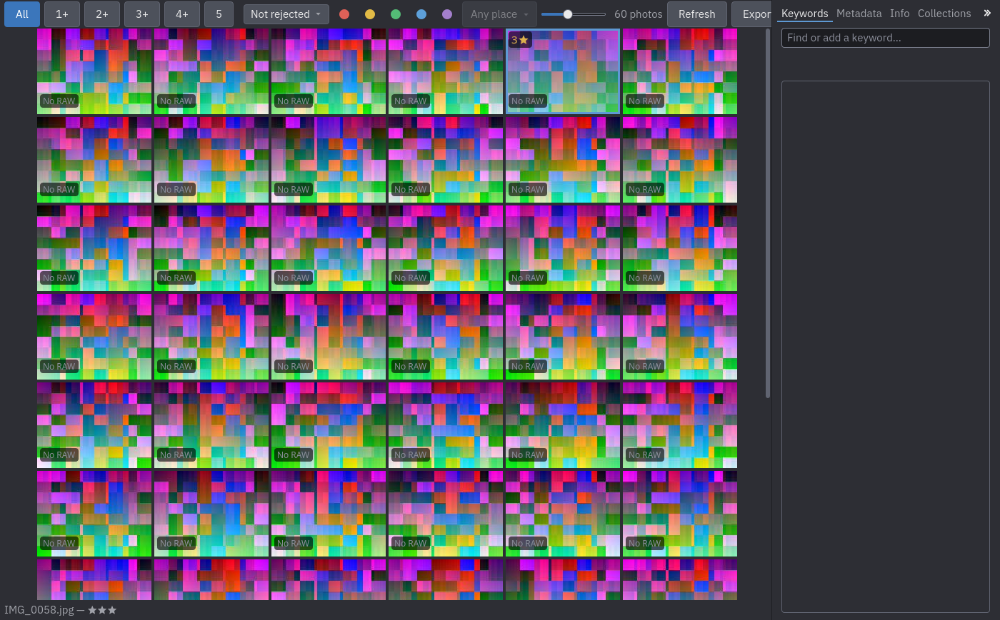
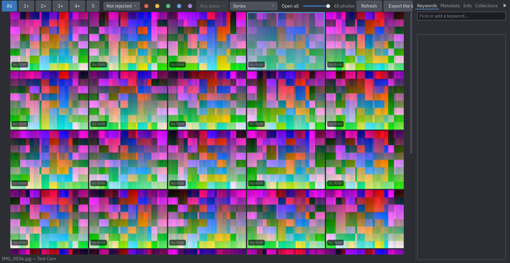
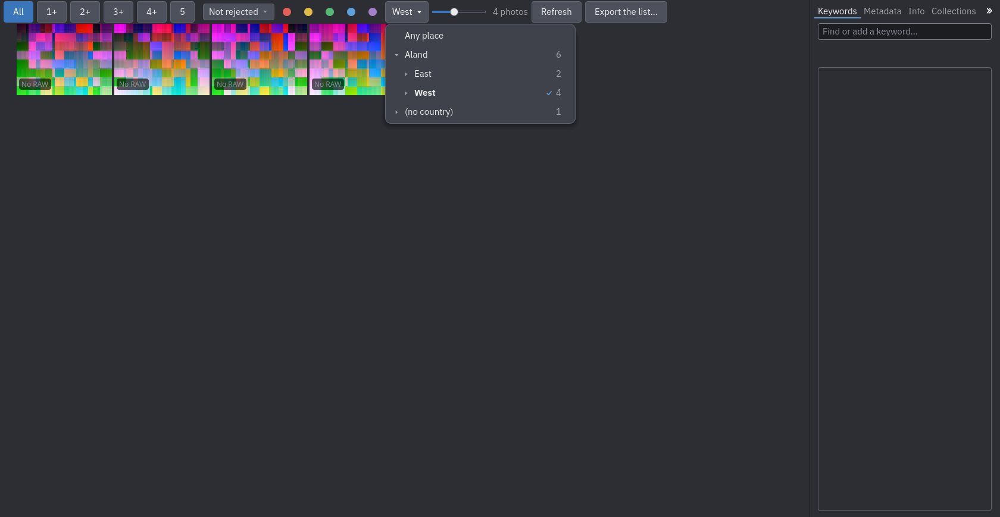
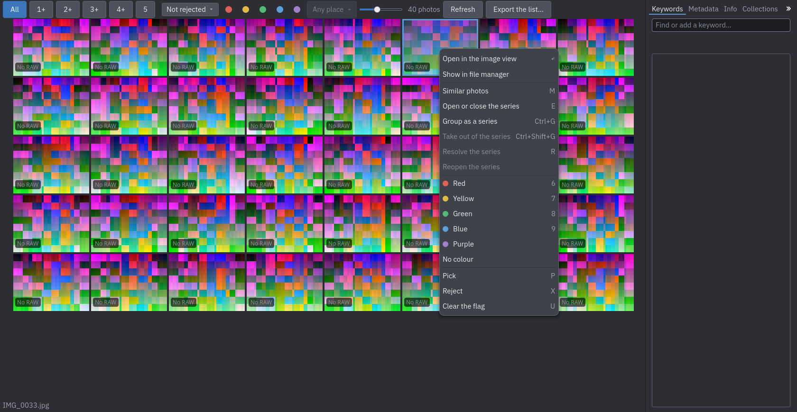
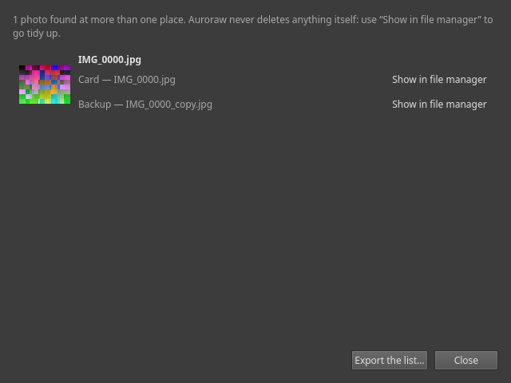

# Browsing your photos

The **Cull** tab shows the catalogue as a grid of thumbnails, the newest photos first, with a filter bar above
it, a strip below it that describes what is selected, and the [keyword panel](06-keywords.md) on the right.

## What a thumbnail shows

- Its **stars** at the top left, its **flag** at the top right (✔ picked, ✖ rejected; a rejected photo is also
  dimmed), a coloured bar along the bottom for its **colour label**.
- For photos that belong to a [series](05-series.md), a badge with the number of photos.
- A **green ring** when you have marked the photo to keep (see [Series](05-series.md)).
- **No RAW**, at the bottom left, for a photo whose only file is a JPEG (or another standard format): there is no
  RAW left to develop for it.
- **Missing**, over a dimmed thumbnail, for a photo whose file the last rescan of its source no longer found (an
  unplugged card, a deleted or moved picture): nothing about the photo itself is lost, and a later rescan clears
  this the moment the file reappears where it was, or is relinked to its new place.

The **slider** in the filter bar sets the **size of the thumbnails**, from small (many photos on screen) to large
(256 pixels on the long side, the size of the stored thumbnail); the grid keeps the size you chose. Resizing the thumbnails after scrolling keeps
what you click and what is selected the same photo.

## Selecting

Selecting works as in a file manager.

| To select | Do |
| --- | --- |
| One photo | Click it |
| Add or remove one | `Ctrl`+click, or `Space` on the photo under the keyboard cursor |
| A range | `Shift`+click (or `Shift` with the arrow keys); `Ctrl+Shift`+click adds a range to what is selected |
| Several by dragging | Drag a rectangle over empty space (a rubber band); hold `Ctrl` to add |
| Everything | **Edit ▸ Select all** (`Ctrl+A`) |
| Nothing | `Escape`, or **Edit ▸ Select none** (`Ctrl+Shift+A`); clicking empty space does the same |
| The others | **Edit ▸ Invert selection** (`Ctrl+Shift+I`) |

The arrow keys, `PageUp`, `PageDown`, `Home` and `End` move the selection (the keyboard cursor); with `Ctrl` they
move the cursor and leave the selection alone. The strip under the grid describes the selected photo (its file,
camera, stars and flag), or says how many photos are selected.

Rating, flagging, labelling and keywords act on **everything selected** as one action (one `Ctrl+Z`), or on the
photo under the cursor when nothing is selected.

## Filtering

The filter bar narrows what the grid lists; the filters combine, and the count beside them says how many photos
they list.

- **All, 1+, 2+ … 5**: photos with at least that many stars.
- **Not rejected / All photos / Picked / Rejected**: rejected photos are hidden by default. Nothing is ever deleted;
  choose *Rejected* or *All photos* to see them.
- **The five coloured dots**: only photos with that colour label; click the same dot again to list all.
- **Series** (appears once the catalogue has series): all, in a series, unresolved series, resolved series; and
  **Open all / Close all** for every series.
- **Any place**: a menu of the places the photos in view are in, as a tree **Country ▸ Region ▸ City** with the number
  of photos at each. Click a place to list only the photos from there ("everything from Quebec": a country is all that
  is in it, a region all its cities); the button then shows its name, and **Any place** at the top of the menu lifts the
  filter. The small arrow before a country or a region opens it without choosing it, and Up, Down, Right, Left,
  Return and Escape work in the open menu. The counts are those of the photos the *other* filters list, so choosing
  Québec still shows Ontario with its count. A photo that has a city or a region but **no country** (typed by hand,
  written by another application, or a country you emptied on purpose) is listed under **(no country)**, at the end of
  the menu, with its regions and cities as for a country. The button is greyed out while no photo in view has a place:
  places come from [Find place names](06-keywords.md), or from what you typed in the Metadata tab. (While Auroraw reads
  the places of your photos for the first time, which takes a minute on a large library, the button says so.)

  

- **Keyword**: choose *Show the photos with this keyword* in the keyword panel's menu; a chip *Keyword: Peru ×*
  appears, and its × removes the filter.

A photo you reject **stays where it is, dimmed**, until the list is next read (a filter change or **Refresh**), so
the grid does not shift under you while you cull. **Refresh** reads the list again: photos that arrived, rejected
photos that were left in place.

**Export the list…**, next to Refresh, writes the file of every photo the grid lists **right now**, one absolute path
a line, to a text file you name. It follows whatever filters are active, so it exports the rejected photos when you
have filtered to *Rejected*, the photos of a keyword when you have filtered to it, and so on; it is greyed out when
the grid lists nothing. Nothing is deleted or moved by this: the list is for tidying up (in a file manager, a script)
outside Auroraw, which never touches your originals on its own (D-018).

## The menu on a photo

A right click on a photo opens a menu: open it in the [image view](04-culling.md), **show it in the file manager**
(the file's folder, selected on macOS and Windows; on Linux, which has no portable way to select a file, only the
folder opens), give it a colour (including purple, which has no key), pick, reject or clear its flag, show the
[similar photos](05-series.md#similar-photos), and the series commands. The image view's own menu has the same rows,
for the photo it shows.

## Duplicate photos

**Tools ▸ Duplicate photos…** (`Ctrl+D`) lists every photo Auroraw has found at more than one place: the same folder
added twice, or a working folder and its backup, for instance. Auroraw notices this itself, while adding or
rescanning a source, and only after checking the whole file, not just a quick fingerprint — so what is listed here
is a real, confirmed duplicate, not a guess. Each one shows where it lives, with a **Show in file manager** button
next to every location. The dialog can be resized (drag its bottom-right corner) when the list is long.

This is a **report, nothing more**: Auroraw never deletes, merges or picks a copy to keep for you (D-018). Use the
list to go tidy things up yourself, in a file manager, outside Auroraw. **Export the list…** writes it to a text
file, the same report the CLI's own `duplicates` command prints.

## Next

[Culling](04-culling.md).
