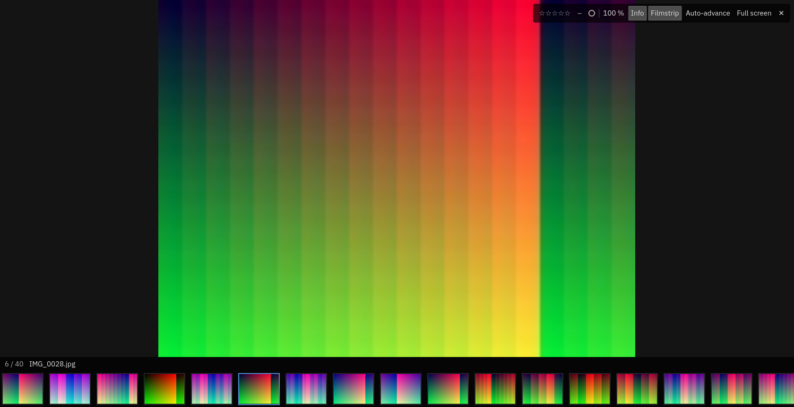
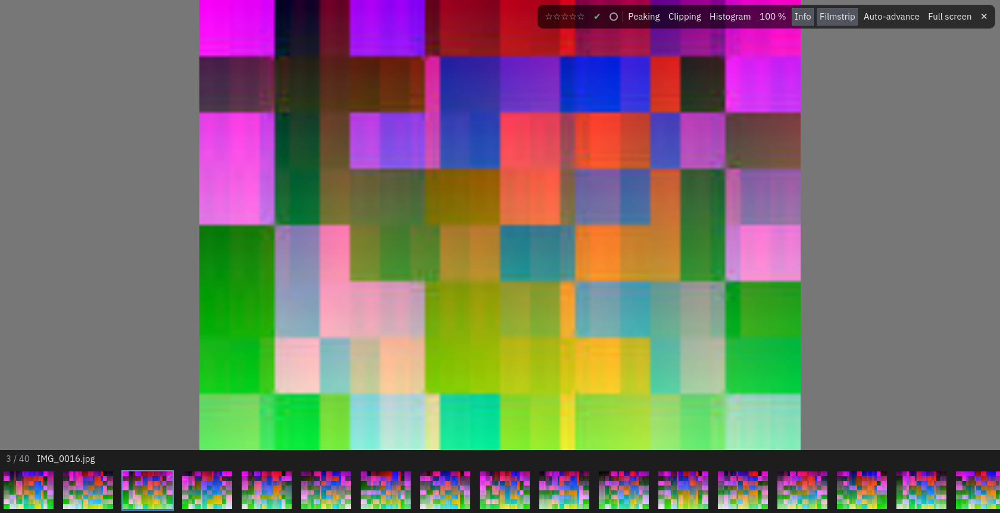

# Culling

Culling is going through a shoot and deciding what is good: giving photos stars, picking the ones you keep,
rejecting the ones you do not, and marking some with a colour. Everything here is one key, and everything can be
undone.

## Stars, flags and colours

| Key | What it does |
| --- | --- |
| `0` to `5` | Rate: 0 clears the stars, 1 to 5 sets them |
| `P` | **Pick** the photo; pressing `P` again on a picked photo takes the flag off |
| `X` | **Reject** the photo; pressing `X` again takes the flag off |
| `U` | Clear the flag |
| `6` `7` `8` `9` | Red, yellow, green, blue label; the same key again takes the label off |

Purple has no key: use the coloured buttons of the [image view](#the-image-view) or the photo's right-click menu.

The keys act on everything selected in the grid (see [Browsing](03-browsing.md)), or on the photo under the
cursor. With several photos selected, the flag rule is: if every selected photo already has that flag it is taken
off, otherwise it is set on all of them. A **rejected photo is not removed from the grid on the spot**: it stays,
dimmed, until you refresh or change a filter, and the default filter then hides it. Nothing is ever deleted.

Stars, flags and colour labels are written to the photo's information (its sidecar) straight away.

The flag keys do nothing on a photo of a **resolved series** (see [Series](05-series.md#what-a-resolved-series-takes)):
its flags are what the resolution decided. Reopen the series to change them.

## Undo and redo

`Ctrl+Z` undoes the last thing you did to your photos, and `Ctrl+Y` redoes it; **Edit** names the step (*Undo 12
ratings*, *Undo flag*, *Undo keywords of 3 photos*…). An action on many photos is **one** step. Undo goes back
several steps, and the photos it touched are selected and shown. Undoing works for stars, flags, colour labels,
keywords (assigning, creating, renaming, moving, deleting) and series. The history lasts as long as the workspace
is open.

## The image view

Press `Return` on a photo, or double-click it, to look at it large. The view covers the grid; the photo you were on
is the one shown, and it goes back there when you leave (`Escape` or `Return`).

- **Moving**: `Left` and `Right` (or `Backspace` and `Space`) go to the previous and next photo, `Home` and `End`
  to the first and the last. A **filmstrip** at the bottom shows the neighbours; click one to go there.
- **Zoom**: the photo is fitted to the window. `Z` (or a double click, or the **100 %** button) shows it at its
  own pixels, and `Z` again fits it. The wheel and `+` and `-` zoom about the pointer; drag to move around a
  zoomed photo. The picture is the photo's embedded preview (or the file itself for a JPEG, reduced to at most 4096
  pixels on its long side).
- **Rating and sorting** work with the same keys as in the grid. At the top right, the photo's **state** is shown in
  its colours (stars, flag, colour label) and each is a button that goes round its states: click the stars to
  cycle 0 to 5, the flag to cycle none, picked, rejected, and the dot to go through the colours, purple included.
- **Auto-advance** (`A`, or the button): after a rating, flag or colour key the view moves on to the next photo, so
  a whole shoot can be culled with one hand on the number keys. It is remembered.
- **Information and filmstrip**: `I` shows or hides the line about the photo (its place in the list and its file),
  `T` the filmstrip; both are remembered.
- **Full screen**: `F` (or `F11`) makes the window full screen with no menu; `F` again, or closing the view, gives
  the window back as it was (maximised or not).
- A **right click** opens the photo's menu (colours and flags).

`C` opens the [comparison](05-series.md#comparing-frames) of the series of the photo shown.

Photos are made ahead: while you look at one, the next two and the previous one are prepared, so that moving on
is immediate. If a photo's original cannot be reached (an offline source), its thumbnail stays and the view says
*The original is not available*.

## Judging sharpness and exposure

Three aids help you tell a sharp frame from a soft one and a good exposure from a burnt one. Each is a button in
the image view's toolbar, has a key, and is remembered.

| Key | Aid | What it shows |
| --- | --- | --- |
| `S` | **Peaking** | Red on the edges that are in focus |
| `O` | **Clipping** | Red where the highlights are burnt out, blue where the shadows are blocked |
| `H` | **Histogram** | The spread of the tones (brightness, and red, green, blue) in a corner of the picture |

The information line also gives a **sharpness** figure. It compares frames with each other (100 % is the sharpest
of the series); it does not mean much for a single photo, and it is a suggestion, never a decision.

**A limit to know.** These aids are computed on the picture you see: the camera's embedded preview, or the JPEG
itself, not on the RAW data. A preview has been processed by the camera (contrast, sharpening, tone curve), so
its clipping and its edges differ somewhat from the RAW file's. For choosing the best frame of a burst this is
usually enough; for judging the real clipping of a RAW file it is not. Computing the aids on the RAW data is planned
with the image engine.

## Marking photos to keep

`K` (or the **Keep** button) puts a **keep mark**, a green ring, on the photo; `K` again removes it. Marks are
drafts, held in memory for the session: they change nothing on disk and are forgotten when you close the
workspace. They serve to resolve a [series](05-series.md), so the **Keep** button, like the **Compare** button, appears
in the image view only for a photo that is in a series.

## A fast way through a shoot

1. Open the first photo of the shoot in the grid (click it, `Return`).
2. Press `A` to turn auto-advance on.
3. For each photo press a number for the stars, or `P` or `X`; the view moves on by itself. `Left` goes back if you
   change your mind, and `Ctrl+Z` undoes the last action.
4. `Escape` returns to the grid. Filter to *Picked* or to `4+` stars to see what you kept.

## Next

[Series](05-series.md): bursts and brackets shown as one photo.
