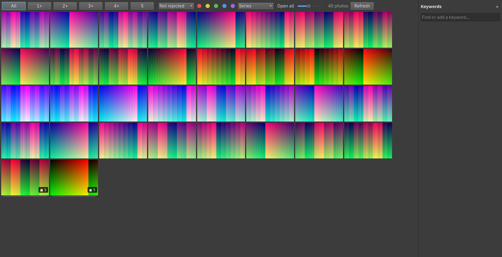
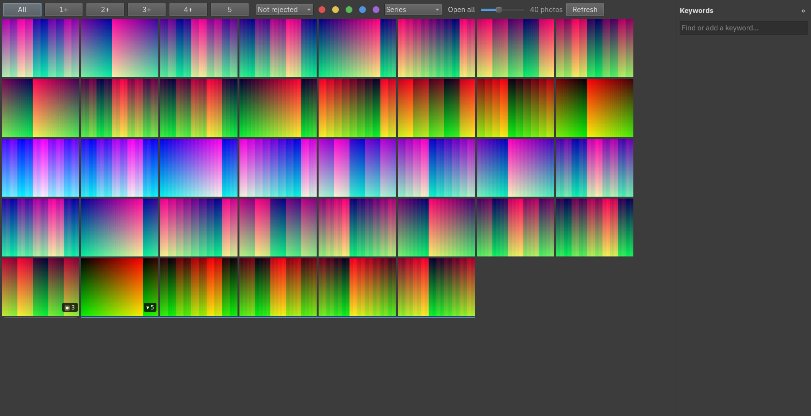
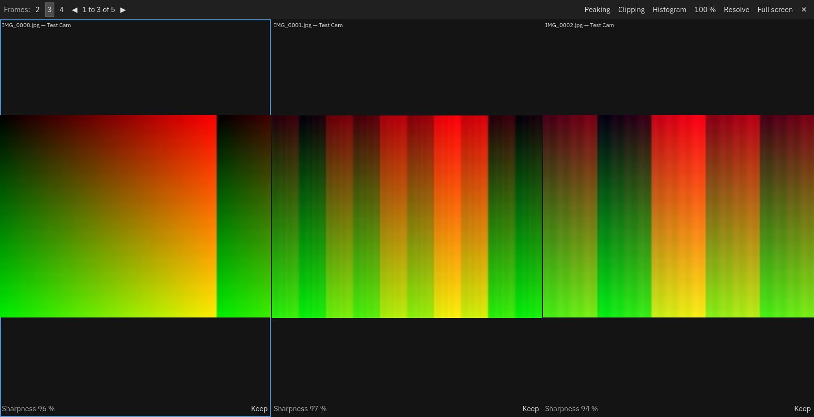
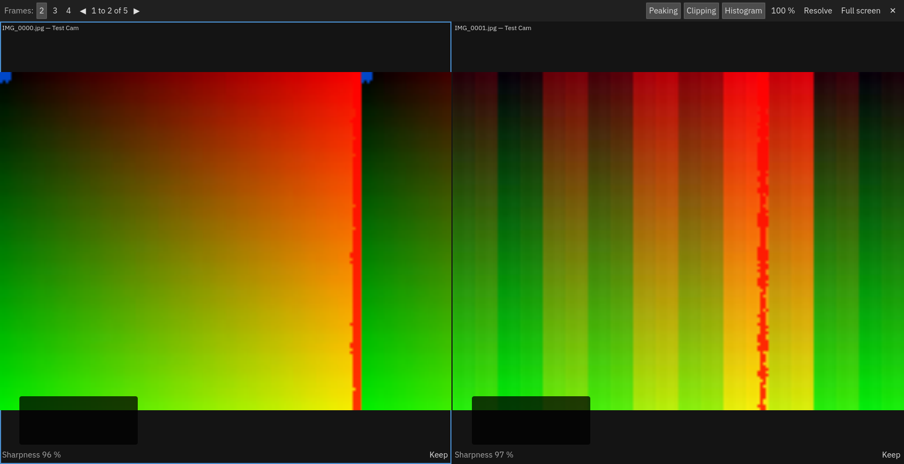

# Series

A **series** is a group of photos that belong together: the frames of a burst, or the exposures of a bracket. A
series is shown in the grid as **one thumbnail** with the number of photos, so a burst of twenty frames takes one
place instead of twenty.

## How series form

When photos arrive (at the end of a scan or an import), Auroraw groups the photos that

- come from **the same camera**,
- were taken **at most 2 seconds apart** (this gap is a setting), and
- have a capture time (a photo with no date never joins a series).

A series has at least two photos, and at most 100 (a long run of shots is cut). It is a **bracket** when it has three
or more photos with the same aperture, ISO and focal length and different exposure times, and a **burst**
otherwise. Its **cover**, the picture shown when it is closed, is its first frame.

In **File ▸ Settings…** you can change the gap and press **Regroup the series now**: the series that were made
automatically and are not resolved are formed again with the new gap. Series you made by hand, and series you
resolved, are never touched.

## Opening and closing

Click a series' badge (▣ and the count), or press `E` with the cursor on it, to **open** it: its photos appear in
place, **in the order they were taken**, joined by a line under them. The badge (▾) or `E` closes it. **Open all**
and **Close all** in the filter bar do every series at once. Opening the image view on a closed series opens it and
starts at its first frame.

## A closed series is one thing

Selecting a closed series selects **all** its photos, so what you do to it happens to all of them, in one step:
`X` rejects the whole burst, `5` gives every frame five stars, a keyword is given to all of them. Open the series
to treat its photos one by one.

## Comparing frames

Small thumbnails make it hard to choose between frames. Press `C` with the cursor on a series (open or closed), or
select 2 to 4 photos and press `C`, to **compare them side by side**.

- The frames are shown **2, 3 or 4 at a time** (buttons *Frames* at the top); a series with more frames is shown in
  **pages**: `PageUp` and `PageDown`, or the arrows at the top, turn the page, and `Left` and `Right` move the focus
  from frame to frame, past an end onto the next page. The focused frame has a blue border.
- **Zoom and pan are linked**: the wheel, `+`, `-` and a drag act on all the frames together, so you can look at
  the same detail (an eye, a whisker) in each one. `Z` (or *100 %*) fits them all, or shows them at their own
  pixels.
- Each frame shows its **sharpness** as a percentage of the sharpest of the series, once all of them are measured.
  This is a hint for where to look first, not a choice made for you.
- `S`, `O` and `H` turn on the [aids](04-culling.md#judging-sharpness-and-exposure): peaking, clipping, and a
  histogram on each frame.

- The keys for stars, flags and colours (`0` to `5`, `P`, `X`, `U`, `6` to `9`) act on the **focused** frame.
- `K` (or the frame's **Keep** button) **marks** the focused frame to keep; a green ring shows it in the comparison,
  in the grid and in the image view's filmstrip.
- `R` **resolves** the series and closes the comparison. `Escape` closes it without resolving.

Marking then resolving is the fastest way to sort a burst: compare, mark the frames worth keeping, press `R`.

## Resolving a series

Resolving is choosing the frames you keep from a burst. Mark the frames to keep (`K`, in the grid, the image view or
the comparison), or select them (click, `Ctrl`+click for several), and press `R` (or *Resolve the series* in the
photo's menu). **Marked frames win**: with no marks, the selected frames are kept. The **kept photos are picked**, and **all the others of the series are rejected**, in one step. The series is marked resolved (a ✓ on its
badge) and stays a series; the rejected frames leave the default list, and *All photos* shows them again.
`Ctrl+Z` puts every flag back as it was. *Reopen the series* (in the menu) marks it unresolved again and leaves
the flags alone. `R` on a closed series only opens it, for you to choose. Marks are cleared once a series is resolved.

## Making and unmaking series by hand

- **Group**: select photos and press `Ctrl+G` to make them a new series. A photo leaves the series it was in; a
  series left with a single photo disappears. To **merge** two series, select both (they are selected whole when
  closed) and group; to **split** one, open it, select some of its photos and group.
- **Take out**: `Ctrl+Shift+G` takes the selected photos out of their series, or dissolves a closed series that is
  selected.
- Both are steps you can undo.

## Filtering

The **Series** menu in the filter bar lists all photos, only photos in a series, only those of **unresolved**
series (what is left to sort out), or only those of **resolved** ones.

## Next

[Keywords](06-keywords.md).
