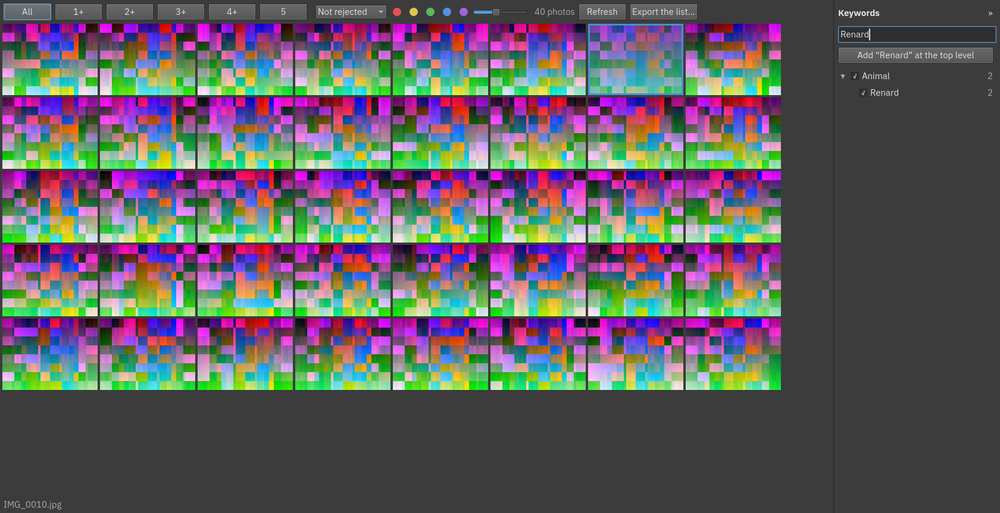
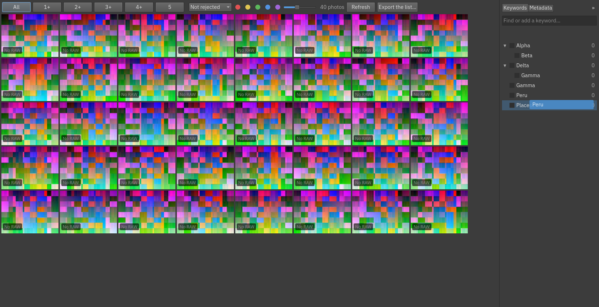
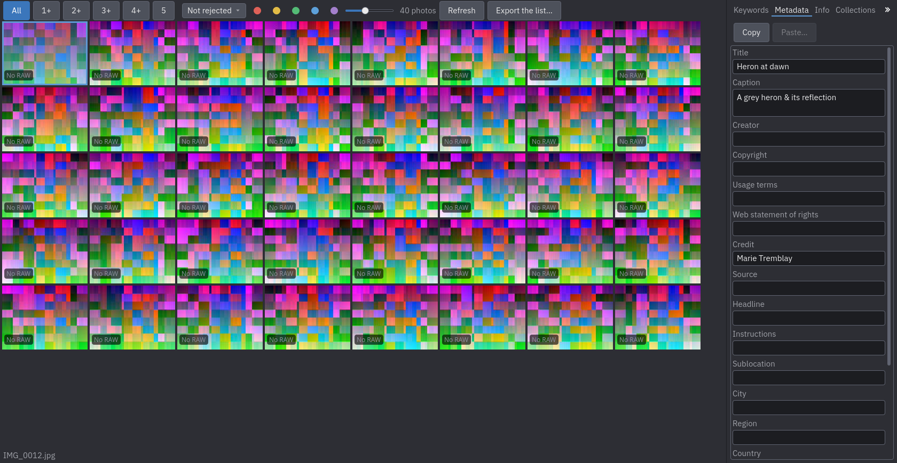
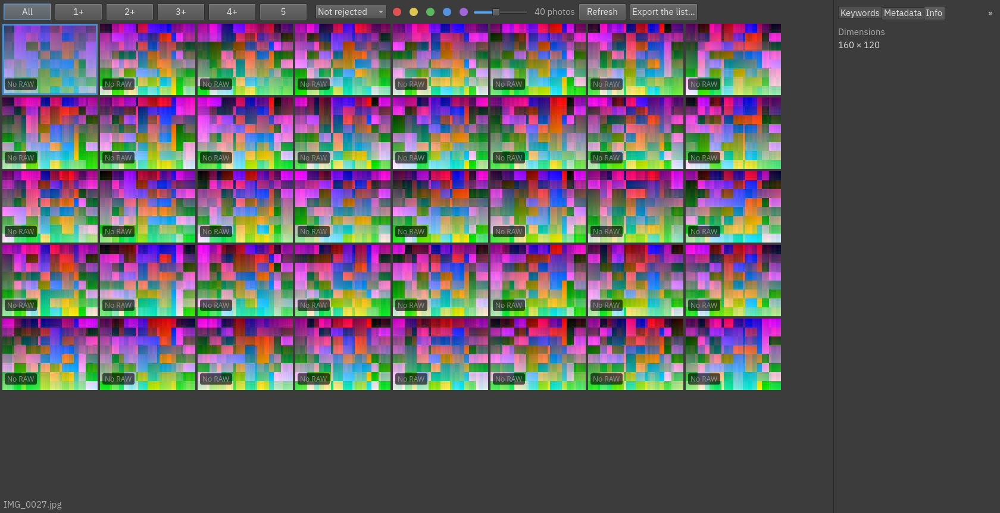
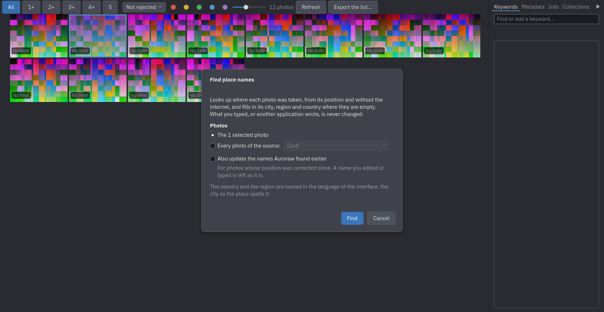
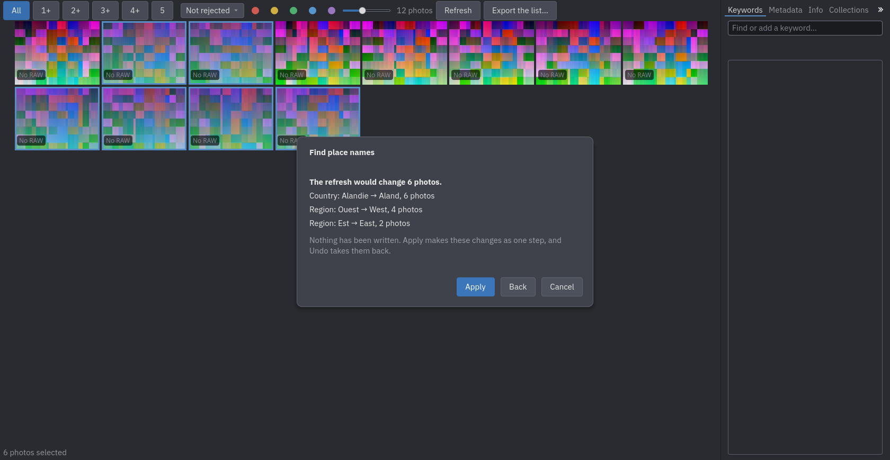
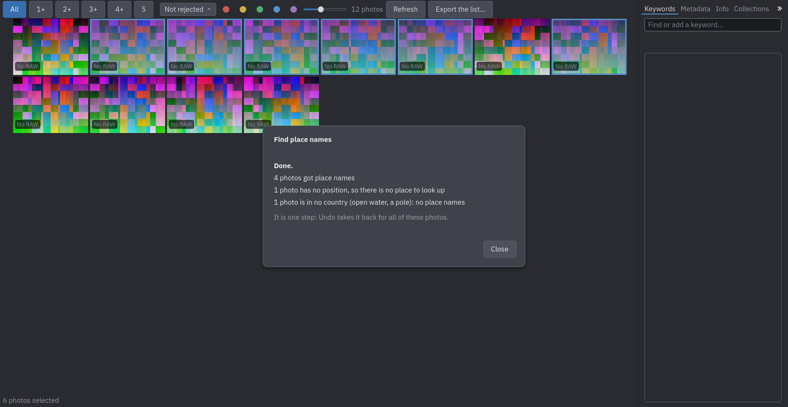
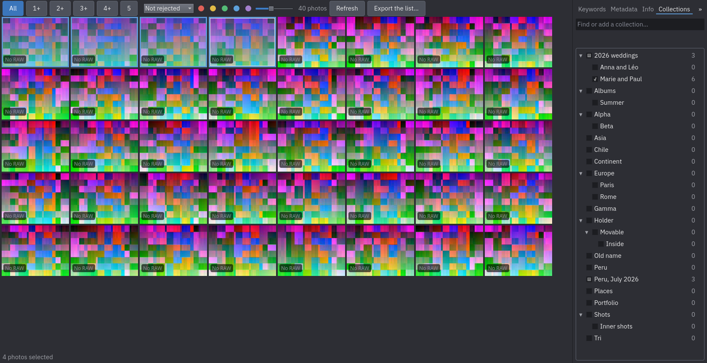

# Keywords

Keywords describe what is in a photo (*Animals*, *Peru*, *Cusco*). Auroraw keeps one **vocabulary** of keywords,
arranged as a tree (*Places ▸ Peru ▸ Cusco*), and you give photos the keywords they deserve. The panel on the
right of the grid has four tabs, **Keywords**, **Metadata**, **Info** and **Collections**; `Ctrl+K`
(**Tools ▸ Keywords**) switches to the first and puts the keyboard in its field, `Escape` gives it back to the
grid, and the `«` and `»` buttons fold the panel away or bring it back. Drag its left edge to make it wider or
narrower (a double click gives back the default width); it remembers its width, whichever tab is showing.

## Giving keywords to photos

Select photos in the grid. In the panel, each keyword has a check that shows **none, some or all** of the selected
photos carry it, and a number that says how many photos have it in the whole catalogue. Click the check to give
the keyword to **all** the selected photos, or to take it off all of them: one step, undone with `Ctrl+Z`.

## Finding and adding a keyword

The field at the top is for **type-ahead**: it filters the tree as you type (a match shows with the keywords above
it). Then:

- `Enter` gives the best match to the selected photos.
- If nothing matches, `Enter` **creates** the keyword and gives it to the selected photos, as one step.
- To add a keyword whose name exists **elsewhere in the tree** (a *Fox* under *Animals* and another at the top
  level), click the button that appears under the field (*Add "Fox" at the top level*), or press `Shift+Enter`.
- Two keywords under the same parent cannot have the same name (whatever the case).

Where a new keyword goes: at the top level, unless you clicked a keyword first: the line under the field then says
*New keywords go under Animals*, and the × puts that back.

## Organising the vocabulary

Right-click a keyword (or use its menu) for:

- **Show the photos with this keyword**: filters the grid (and its sub-keywords).
- **Rename…**: every photo that has it follows.
- **Move to…** and **Move to the top level**, or **drag and drop** a keyword onto another one to make it a child of
  it (drop it anywhere in the panel with no keyword under it to make it a top-level keyword). A keyword cannot be
  moved under itself.
- **Delete…**: deletes the keyword **and the keywords under it**; the confirmation says how many keywords and photos
  are affected. The photos lose those keywords.
- **Properties…**: sets **synonyms** (one a line — typing a synonym in the field above finds the keyword it belongs
  to, the same as its own name) and **Do not export**, which will keep the keyword out of exported photos once
  exporting itself exists.

Creating, renaming, moving, deleting keywords and setting their properties can all be undone with `Ctrl+Z`, and
deleting brings back the same keywords on the same photos.

## Where keywords are kept

A photo's keywords are written in its sidecar, with the vocabulary in the workspace, so they survive rebuilding
the catalogue and can be backed up with the workspace (see [Your files and their safety](07-your-files-and-safety.md)).

## Metadata

The **Metadata** tab edits a photo's title, caption, creator, copyright and the rest of its plain-text IPTC and
XMP fields — one field a line, except **Persons shown**, which takes one name a line. With
several photos selected, a field where they disagree shows *Multiple values*; typing in it and leaving the
field (`Tab`, a click elsewhere, or `Enter`) sets it on **all** the selected photos, one step, undone with
`Ctrl+Z`. Leaving a field empty clears it.

## Info

The **Info** tab shows the active photo's own technical metadata — camera, lens, exposure (shutter speed,
aperture, ISO, focal length), dimensions, orientation, GPS position and serial number, when the file carries
them — read-only, and always for the one photo the grid's cursor is on, not a selection. A field the photo
does not carry (most photos have no GPS position, for instance) is left off the list rather than shown empty.

## Place names

**Tools ▸ Find place names…** (`Ctrl+Shift+L`) fills in the **City**, **Region**, **Country** and **Country code**
fields of the Metadata tab from where a photo was taken. It uses the photo's position (the one in the file, or the
one you corrected) and a file of places that comes with Auroraw, so nothing is sent anywhere and it works without the
internet.

- **Which photos.** The selected photos, or every photo of one source.
- **Only what is empty.** A field you typed, or that another application wrote, is never changed, and neither is
  **Sublocation** (the market, *Chez Marie*). If you change one of the four fields afterwards, even by typing the
  same word again or by clearing it, Auroraw takes that as your answer and does not touch it again.
- **In which language.** The country and the region are named in the language of the interface (English or
  French); the city is written the way the place spells it (*Montréal*, whatever the language).
- **Also update the names Auroraw found earlier.** For photos whose position was corrected since (a GPS track
  matched, a hand correction), or when you changed the language: the names Auroraw wrote and you have not touched
  follow the new position. A name you edited or typed is still left as it is. Nothing is changed before you have
  seen it: Auroraw first shows what the refresh would do, grouped ("City: Westville → Eastburg, 400 photos"), and
  **Apply** makes the changes; **Back** leaves them undone. (Without this box, a run only fills what is empty, so it
  goes straight ahead.)
- **One step.** The whole run is a single step, whatever the number of photos, and `Ctrl+Z` takes it back for all
  of them. You can stop it with **Stop**; what it found stays, as one step.
- **What it says at the end**: how many photos got names, how many already had their place, how many have no
  position, and how many are in no country (open water, a pole).

The **city is the town the position belongs to**, not the municipality that contains it: the biggest town whose
reach covers the position (a town reaches about 10 m for each square root of its inhabitants, 13 km for Montréal, 350 m
for a village of 1,200), otherwise the nearest one within 25 km. A photo taken in a borough of a large city reads as that
city, and an independent town inside it as the city around it. Near a border the answer can be wrong by a kilometre
or two, because the boundaries are simplified. A photo far from any town has a region and a country and no city, which
is true.

**At import.** The Import dialog has a check box, **Find the place names of the imported photos**, off until you turn
it on and remembered after that. It looks the names up once the import has finished, for the photos that entered the
catalogue, as one step.

**If the file of places is not there** (a copy of Auroraw built without it), the dialog says *Place names are not
installed* and the rest of the application is unaffected.

**Where the data comes from.** The towns are adapted from GeoNames
([Creative Commons Attribution 4.0](https://creativecommons.org/licenses/by/4.0/), <https://www.geonames.org/>): the
list is filtered and joined to the polygons of the countries and regions, which are Natural Earth's (public domain).
The borders are drawn as Natural Earth draws them, in its default worldview, and Auroraw takes no position on a
disputed border. A name you correct is never overwritten. The **About** window says so too.

## Collections

The **Collections** tab groups photos by hand, for anything the vocabulary is not about — an album, a delivery,
a shortlist. A collection can hold photos and also hold other collections (a folder inside a folder), shown as
a tree the same way the keyword vocabulary is.

Select photos and type a name in the field at the top: `Enter` puts the selection in the best-matching
collection, or **creates** one with that name and puts the selection in it, as one step, the same as the
keyword field. The check beside each collection shows **none, some or all** of the selected photos are in it;
click it to put the whole selection in, or take it out. Right-click a collection (or use its menu) for
**Rename…**, **Move to…** (or drag and drop it onto another collection, or onto empty space in the tab for the
top level) and **Delete…**, which takes the collection and what is inside it away — the photos themselves are
never touched, only their membership. **Show the photos in this collection** filters the grid by it and by
whatever is inside it. Every one of these is undone with `Ctrl+Z`.

Smart collections (filled automatically by a saved search) come later.

## Next

[Your files and their safety](07-your-files-and-safety.md).
